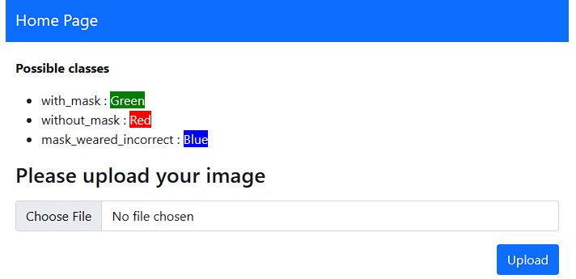
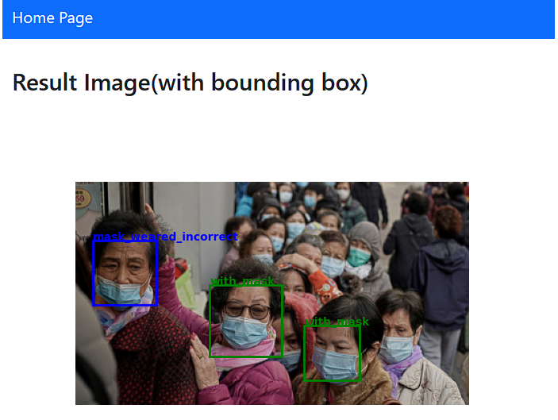

# face-mask-detection

A Face mask detection web application built on Flask

Dataset link [here](https://www.kaggle.com/datasets/andrewmvd/face-mask-detection)
 
## Installation
Use the package manager [pip](https://pip.pypa.io/en/stable/) to install library.

```bash
pip install -r requirements.txt
```

## How to run Flask application
```bash
py index.py
```

Access via any browsers : [127.0.0.1:5000](127.0.0.1:5000)

## Demo

